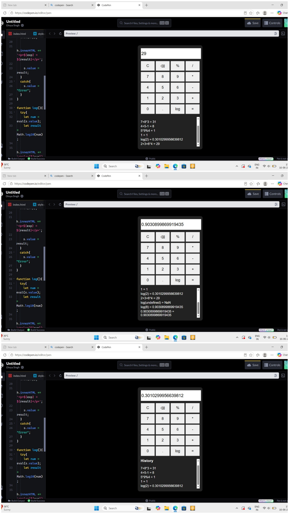

# 🧮 JavaScript Calculator

## 📌 About
This is a simple and responsive calculator built using HTML, CSS, and JavaScript. It performs basic arithmetic operations, percentage calculations, and logarithmic functions. The calculator also maintains a history of calculations and provides error handling for invalid inputs.

## ✨ Features
- ➕ Addition
- ➖ Subtraction
- ✖️ Multiplication
- ➗ Division
- 📊 Percentage Calculations
- 📈 Logarithmic Calculations (log)
- 📝 Calculation History
- ❌ Error Handling
- 📱 Responsive and User-Friendly Interface

## 🛠️ Technologies Used
- HTML
- CSS
- JavaScript

## 🚀 How to Run
1. Clone the repository.
2. Open the project folder.
3. Run `index.html` in your browser.

## 📸 Screenshots

## 👩‍💻 Author
Divya Singh
